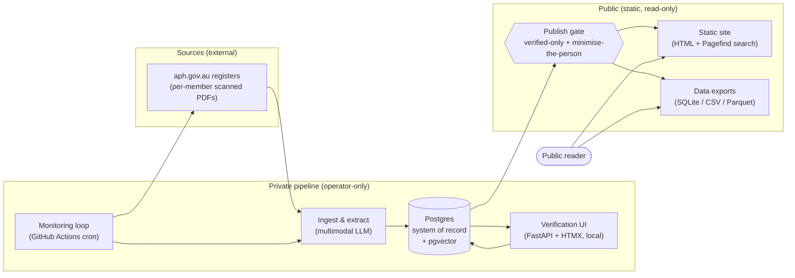
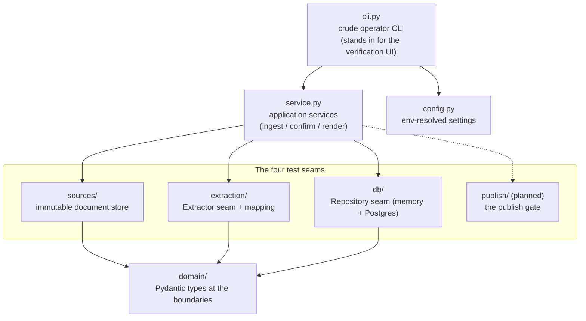
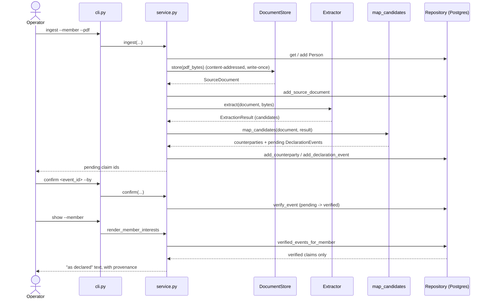
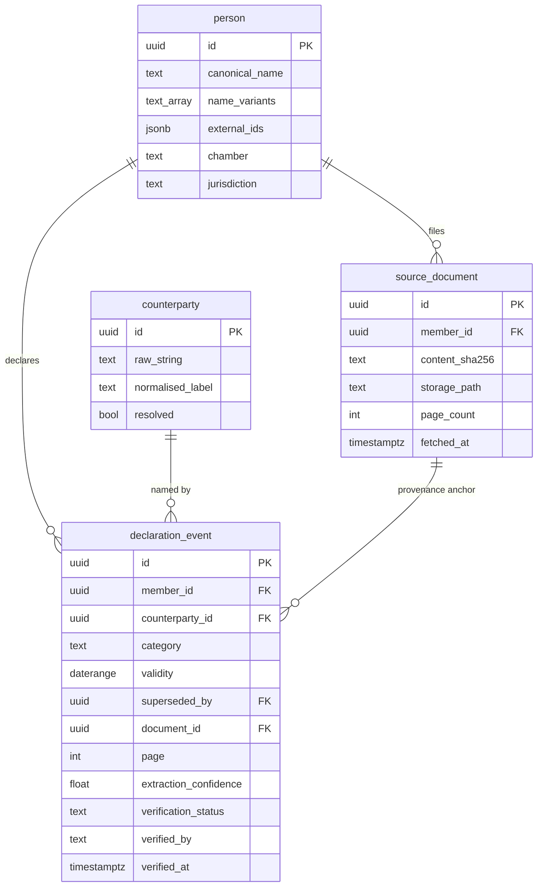
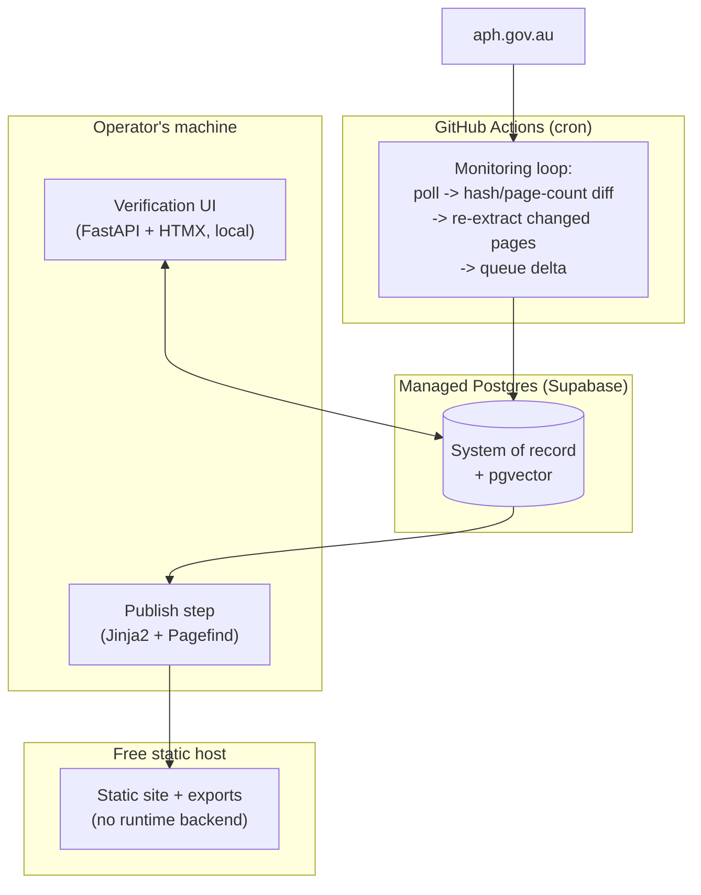

# Plain Sight, Architecture

How Plain Sight is put together, and why. This document describes both the **v1 target architecture** (specified in [PRD.md](PRD.md)) and the **walking skeleton** that exists in the code today. Where they differ, the difference is called out.

For product scope and rationale, read [PRD.md](PRD.md). For the vocabulary used throughout (declaration event, provenance, bitemporal, publish gate, minimise the person), read [GLOSSARY.md](GLOSSARY.md).

---

## The shape of the system

Plain Sight is a **private pipeline plus a one-way publish step to a static public site**. There is no public-facing backend. The Postgres system of record and the operator UI are never reachable by readers; the public only ever sees pre-rendered artifacts produced by the publish gate.

The design objective is to **minimise human-minutes per week**. Everything is automated except the one irreducible human step: confirming or correcting each extracted claim before it can be published.

---

## Non-negotiable properties, and where they live

These six properties from the PRD are the reason the architecture looks the way it does. Each one is anchored to a specific place in the system, so it is enforced structurally rather than by convention. **This table is the canonical list of product invariants.** `AGENTS.md` restates each as an imperative tripwire that links back here; the rationale lives only in this document (and, once a decision changes, in the superseding record under `docs/decisions/`).

| Property | Where it is enforced |
|---|---|
| **Mirrored facts only** (nothing inferred is published in v1) | The data model stores only declared claims; no Type B connection reaches the publish gate. |
| **Counterparties stay provisional** | A declared company/trust/asset is a `counterparty` row with `resolved = false`, referenced by UUID. v1 never asserts a legal identity (e.g. an ACN); display is always "as declared". |
| **Verified-only display** | The **publish gate**: unverified rows are *physically absent* from the public artifacts, not merely filtered by a query. |
| **Minimise the person** | Also the publish gate: household interests published as role-based signals ("spouse holds X"), names only via a logged editorial override. |
| **Never silently edit history** | Append-only, bitemporal event log; corrections are supersession events, the prior version is retained and marked superseded. |
| **Per-claim provenance** | Every declaration event carries a `{document_id, page, extraction_method, extraction_confidence, fetch_timestamp, bbox?}` pointer, attached at the mapping step. |

---

## Modules and seams

The system is a **single installable Python package** (`plain_sight`), not a multi-package monorepo. Modules mirror the test seams one-to-one, so *module ↔ seam ↔ test ↔ issue* line up.

Each seam is a narrow interface with two implementations (a real one and a test double), so the whole flow can be driven deterministically in tests and against live infrastructure in the CLI:

- **`sources/` — the document store.** Content-addressed, write-once storage for source PDFs (named by SHA-256, never overwritten). The immutable source is the provenance anchor.
- **`extraction/` — the `Extractor` seam plus mapping.** The one place a live multimodal model is consulted, behind a `Protocol` (model id is config-driven). `StubExtractor` returns a fixed result so tests assert normalisation and provenance without a network or LLM nondeterminism. `map_candidates` is a pure function: candidates → counterparties + declaration events, where provenance is attached and a declared counterparty becomes a first-class UUID-referenced entity.
- **`db/` — the `Repository` seam.** A `Protocol` with an in-memory implementation (deterministic tests) and a `psycopg` v3 + raw SQL implementation (the real system of record). The verified-only display rule is asserted against the in-memory repo and checked against Postgres under the `postgres` mark.
- **`publish/` — the publish gate (planned).** Reads Postgres and emits the sanitised static artifacts in one pass. The single enforcement point for verified-only and minimise-the-person.

`domain/` holds the Pydantic types used **at the boundaries only** (extractor output, CLI input, rows crossing back into the application), never as a persistence layer. `config.py` is the one place the model id and Postgres URL are read from the environment.

---

## The end-to-end flow (walking skeleton, as built)

The code today implements a **walking skeleton**: one member, end to end, with a crude CLI confirm standing in for the real verification UI. The four CLI commands (`migrate`, `ingest`, `confirm`, `show`) exercise the whole spine.

Every extracted claim starts `pending`. Only `confirm` transitions a claim to `verified`, and `show` renders **verified claims only**, the verified-only filter lives in the repository query so nothing pending can reach the reader.

---

## Data model

PostgreSQL is the single system of record. The core is **append-only and bitemporal**: facts are never mutated, and two independent time axes ("when the interest was held" vs "when it entered the record") make "state as of date D" answerable.

Key modelling decisions:

- **`declaration_event` is the atomic unit of record.** Immutable claim content; verification is a state transition on the row. Provenance is carried per-claim, inline on the event.
- **Valid time is a single half-open `daterange` (`validity`), guarded by a database constraint.** An `EXCLUDE USING GIST` constraint (`declaration_event_no_active_overlap`) makes it *impossible* for two active events to claim overlapping validity for the same `(member, counterparty, category)`, enforced by Postgres rather than application code. The constraint is partial on `superseded_by IS NULL` (superseded versions do not participate) and `DEFERRABLE INITIALLY IMMEDIATE` so a correction can append a successor and mark its predecessor superseded in one transaction. See migration `0002_temporal_integrity.sql`.
- **Corrections supersede, never overwrite.** `superseded_by` points at the successor that replaced a row; `NULL` means active/current. The prior version is retained and marked superseded, never deleted.
- **Opaque UUID primary keys everywhere.** No sequential, publicly enumerable ids, so exports stay stable and non-enumerable.
- **Counterparties are first-class but provisional.** A declared company/trust/asset is a `counterparty` row referenced by UUID, explicitly `resolved = false`. v1 never asserts a legal identity (e.g. an ACN); the UUID is the anchor v2 resolution attaches to.
- **Politicians are hard-resolved.** `canonical_name` + `name_variants` + `external_ids` (Parliament / OpenAustralia / Wikidata) enable tracking the same member across parliaments.

### Skeleton vs v1 target

The migrations (`0001_walking_skeleton.sql`, then `0002_temporal_integrity.sql`, then `0003_bitemporal_query_views.sql`) start minimal and grow toward the full v1 target **without re-modelling the core**:

| Concern | Skeleton (today) | v1 target |
|---|---|---|
| Valid time | ✅ half-open `daterange` (`validity`) with `EXCLUDE USING GIST` preventing overlapping validity per active `(member, counterparty, category)` (migration 0002) | `tstzrange` record axis added when system-time "as of" views exist |
| Corrections | `superseded_by` supersession pointer in place; deferrable constraint lets a correction append + supersede atomically (migration 0002) | full append-only **supersession** workflow + corrections ledger |
| "State as of date D" | ✅ SQL **views** over the event log (`current_interest`, `active_interest`), sliced by valid time; supersession honoured, no stored snapshots (migration 0003) | `tstzrange` record-axis travel ("as the record stood at T") added alongside the record range |
| Counterparty similarity | not yet | **pgvector** embedding + similarity at query time (no materialised clusters) |
| Family members | not modelled | `Person` entities + private household→member edge; public display is role-based signal only |

---

## Deployment

Cheap and mostly-serverless. No always-on server of our own, and no public-facing backend.

- **Managed Postgres with pgvector** is the durable, cloud-reachable system of record. It is hosted on **Supabase**; there is no local Docker Postgres.
- **GitHub Actions cron** drives the monitoring loop (daily-ish is ample; the registers update ~monthly around sitting weeks).
- **The verification UI runs locally** against that Postgres, operator-only.
- **The publish step pushes static artifacts to a free static host.** Public data is as fresh as the last publish run, consistent with "freshness surfaced, not promised".

---

## Extraction: why a multimodal LLM behind a seam

The corpus is small and bounded (~227 federal members; low-thousands of pages per parliament), so this is a **trust problem, not a scale problem**. The sources are frequently handwritten, so extraction is **vision over the scan image**, not OCR-then-parse. Because accuracy dominates and the corpus is tiny, premium per-page model cost is negligible: optimise accuracy, not cost.

The live model (Claude Opus, via the optional `llm` extra) lives **only** behind the `Extractor` `Protocol`, with the model id in config. Consequences:

- Tests mock the boundary and assert mapping, normalisation, and provenance **deterministically**, with no live network and no LLM nondeterminism. The `anthropic` SDK is never imported by the test suite.
- Structured output / tool-use forces the candidate schema; there is no free-text parsing downstream.
- `bbox` provenance is optional and operator-assisted: the model returns the page it read a field from, but never fabricates pixel coordinates.

---

## What v1 defers (built so as not to preclude)

The architecture is deliberately shaped so a **v2 connections layer** can attach without re-modelling the core:

- The stable **counterparty UUID** is the anchor for v2 authoritative resolution (declared string → real company), modelled as an appended `resolution_event`.
- The private **household→member edge** preserves the MP → household → counterparty chain for v2 tracing.
- A **graph** is a v2 concern, introduced as a *derived projection* over Postgres, never a second source of truth.

Explicitly out of v1: MCP server, ASIC/company ownership data, authoritative counterparty resolution, graph database and visualisation, any published inferred connection, commercial tiers/SLAs.
